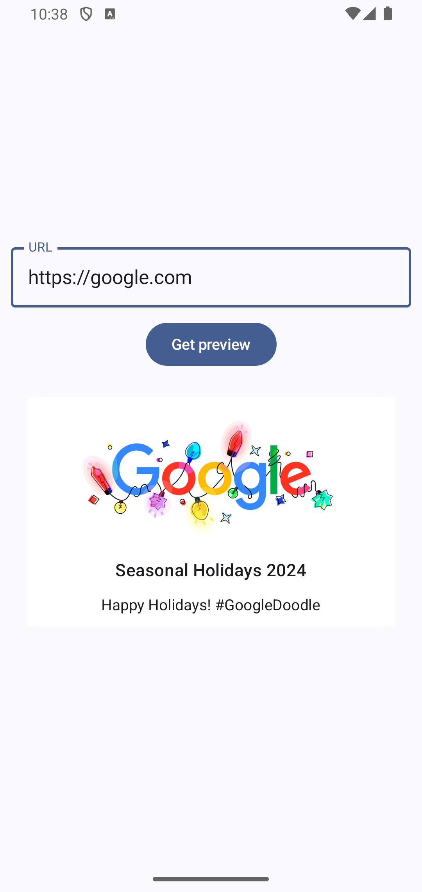

# LinkPreviewApp
**LinkPreviewApp** is a native Android application for generating website previews. The app uses the **LinkPreview API** to retrieve images and descriptions for the preview. [Documentation for LinkPreview API](https://docs.linkpreview.net/)

## Features

The app allows users to create a website preview and navigate to the site by clicking on the preview. The default browser is opened for the link.

## Architecture

* **MVVM Architecture**: The application follows the MVVM (Model-View-ViewModel) design pattern.
* **User interface**: The UI is build using Jetpack Compose toolkit.
* **API Requests**: PreviewApi is responsible for making API calls using Retrofit for sending requests and receiving responses from the server.
* **Dependency Injection**: The app utilizes Hilt for DI.
* **SOLID**: Development was strictly based on SOLID principles.
* **Error Handling**: Comprehensive error and exception handling is in place.

## Testing

Unit Testing: All services, repositories and view models are covered by unit tests using the JUnit4, Mockito and kotlinx-coroutines-test packages. MockWebServer was used for testing PreviewApi.
